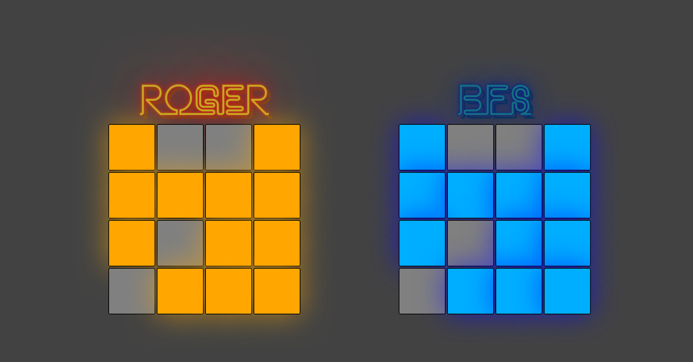

# Lights Out Game

Este jogo *desafiador* e super *empolgante* ver trazer um desafio ao seus jogadores: **apagar todas as luzes do tabuleiro**. Tendo como adversário um computador que sabe de "cabeça" a resolução, o usuário deve mostrar mais agilidade para poder vencer nesse jogo.




## Implementação

O adversário implementado usa um algoritmo de **BFS** que percorre um grafo que é gerado a cada tentativa de jogada do algoritmo, de forma a determinar se existe ou não solução, e caso haja, qual o menor caminho a ser percorrido para tal finalidade. Por meio do uso de *hashs*, é guardado o estado do tabuleiro em sua representação binária e os movimentos que foram necessários para chegar até ele.

## Developers

<table border="0">
    <tr>
        <td>  </td>
        <td>  </td>
    </tr>
    <tr>
        <td align="center"> <a href="https://github.com/youssef-md"> Youssef Muhamad </a> <br> 17/0024334 </td>
        <td align="center"> <a href="https://github.com/rogerioo"> Rogério Júnior </a> <br> 17/0021751 </td>
    </tr>
</table>

# Como Usar

1. Clone o repositório
2. Dentro do diretório execute ```npm install``` para instalar as dependências
3. Execute ```npm start``` para utilizar o projeto localmente em localhost:3000 por padrão

<hr/>
<p align="center"><b>Lights Out</b></p>
<p align="center">Projeto e Análise de Algoritmos - 2º/2019<br /><br />
<a href="https://fga.unb.br" target="_blank"></a>
</p>